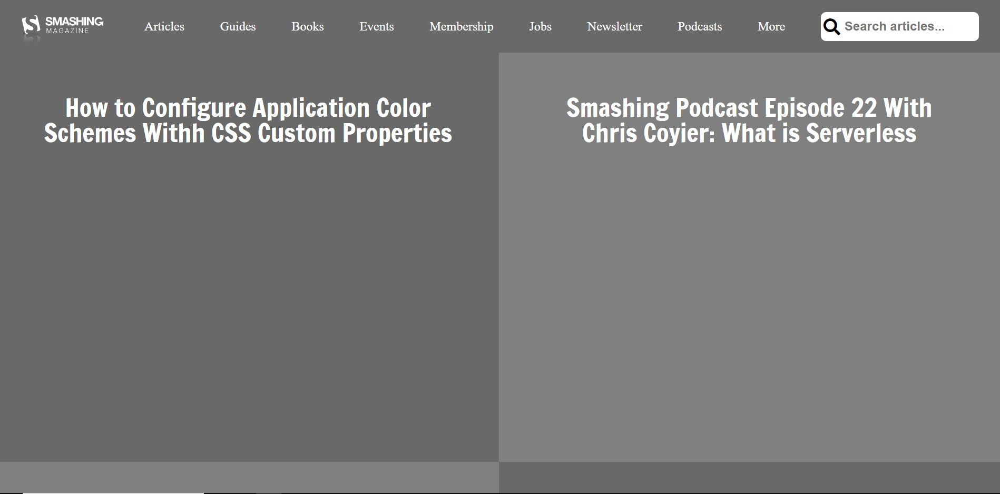

# Smashing magazine heatmap

> Heatmap of the smashing magazine homepage

## Built With

- HTML5,
- CSS3,

## Live Demo

[Live Demo Link](https://raw.githack.com/jonathastavares/Smashing-Magazine-Page-Clone/Homepage/index.html)

## Authors

👤 **Jonathas Tavares**

- Github: [@jonathastavares](https://github.com/jonathastavares)
- Twitter: [@jhstavares](https://twitter.com/jhstavares)
- Linkedin: [linkedin](https://www.linkedin.com/in/jonathas-tavares-24b8bba3/)

👤 **K**

- Github: [@harshdeepkanhai](https://github.com/harshdeepkanhai)
- Twitter: [@harshdeepkanhai](https://twitter.com/harshdeepkanhai)
- Linkedin: [harshdeepkanhai](https://www.linkedin.com/in/harshdeepkanhai)

## 🤝 Contributing

Contributions, issues and feature requests are welcome!

Feel free to check the [issues page](issues/).

## Show your support

Give a ⭐️ if you like this project!

## Acknowledgments

- Inspiration from the [Smashing Magazine](https://www.smashingmagazine.com/)
- the Odin Project

## 📝 License

This project is [MIT](lic.url) licensed.